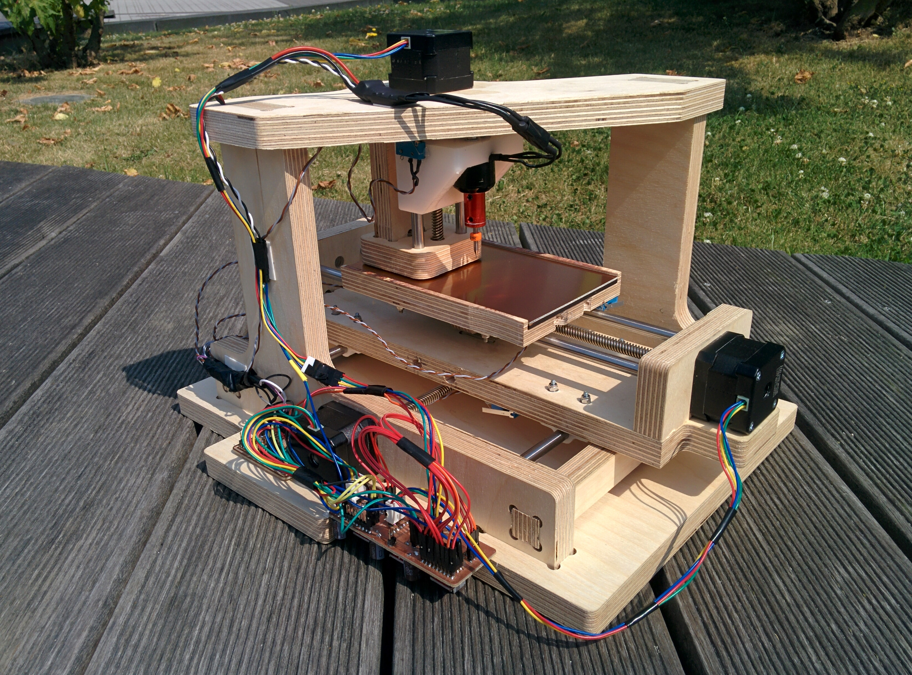

# FabPCBMaker
A fabbable, cheap, light and small CNC for PCBs

## Project Development
I developed this project as a final project for FabAcademy 2017. My idea was to make it possible to make a CNC mill for PCBs in a FabLab at an as low as possible cost (less than 100€). 
In this page I will be providing Information on how to replicate this along with the design files required  

## Thanks 
Daniele Ingrassia

Fablab Kamp-Lintfort
Hochschule Rhein-Waal
Friedrich-Heinrich-Allee 25, 47475 Kamp-Lintfort, Germany
fablab@hochschule-rhein-waal.de

## License
This work is licensed under the terms of Attribution-NonCommercial-ShareAlike 4.0 International ([CC BY-NC-SA 4.0](https://creativecommons.org/licenses/by-nc-sa/4.0/))

